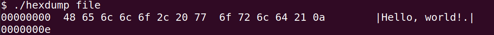

# hexdump



A simplified clone of the `hexdump -c` Linux command.

It is used to display the contents of a file as a stream of hexadecimal values and their equivalent ASCII representation.

## Usage

Compile with make:

```sh
$ make
```

Alternatively, compile as:

```sh
$ gcc -o hexdump -Wall src/hexdump.c
```

An executable file `hexdump` will ge generated.

## Usage

```sh
./hexdump <file> [<count>]
```

It will display the hexadecimal byte-by-byte contents of `<file>` and stop at either the end of the file or when `<count>` bytes have been displayed. The `<count>` parameter is optional.

## Examples

To print all bytes of file `test.wav`:

```sh
./hexdump test.wav
```

To print the first 10 bytes of `test.wav`:

```sh
./hexdump test.wav 10
```

## LICENSE

MIT
